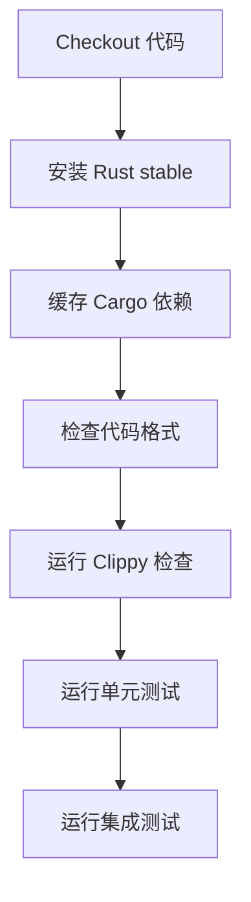
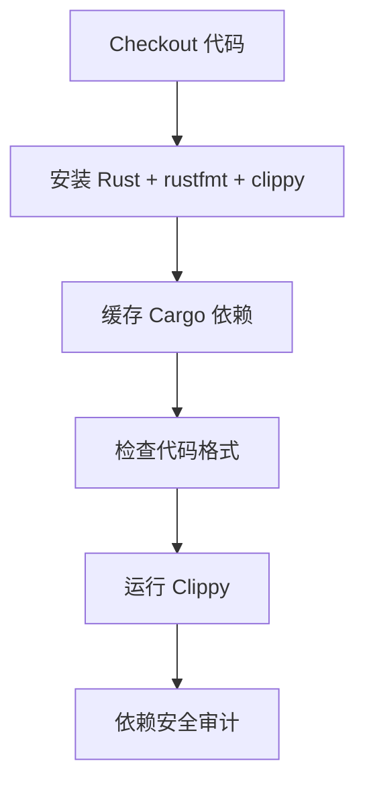
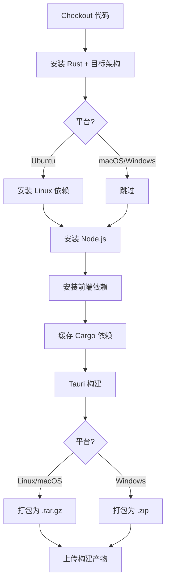
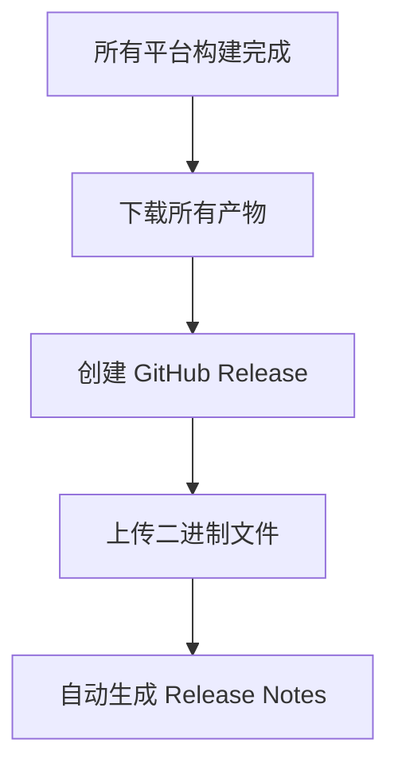

# 🚀 GitHub Actions CI/CD 工作流介绍

本项目配置了完整的 CI/CD 流水线，包含 **3 个工作流**，自动化测试、代码检查和多平台构建发布。

---

## 📊 工作流总览

```
┌─────────────────────────────────────────────────────────────┐
│                    GitHub Actions                           │
├─────────────────────────────────────────────────────────────┤
│                                                             │
│  1️⃣  Test (test.yml)      - 自动化测试                      │
│  2️⃣  Lint (lint.yml)      - 代码质量检查                    │
│  3️⃣  Build (build.yml)    - 构建和发布                      │
│                                                             │
└─────────────────────────────────────────────────────────────┘
```

---

## 1️⃣ 测试工作流 (test.yml)

### 🎯 触发条件
- ✅ 推送到 `main` 或 `dev` 分支
- ✅ 创建 Pull Request 到 `main` 分支

### 🖥️ 运行平台（矩阵策略）
```
┌──────────────┬──────────────┬──────────────┐
│   Ubuntu     │    macOS     │   Windows    │
│   Latest     │   Latest     │   Latest     │
└──────────────┴──────────────┴──────────────┘
```

### 📋 执行步骤



**详细步骤：**

1. **Checkout 代码** - 拉取最新代码
2. **安装 Rust** - 使用 stable 工具链
3. **缓存依赖** - 缓存 `~/.cargo` 和 `target/` 目录
4. **代码格式检查** - `cargo fmt --check`
5. **静态分析** - `cargo clippy` (警告视为错误)
6. **单元测试** - `cargo test --lib`
7. **集成测试** - `cargo test --test '*'`

### ⚡ 性能优化
- 使用 Cargo 缓存，加速后续构建
- 并行运行 3 个平台的测试
- 缓存键基于 `Cargo.lock` 哈希值

---

## 2️⃣ 代码检查工作流 (lint.yml)

### 🎯 触发条件
- ✅ 推送到 `main` 或 `dev` 分支
- ✅ 创建 Pull Request 到 `main` 分支

### 🖥️ 运行平台
- Ubuntu Latest（仅一个平台）

### 📋 执行步骤



**详细步骤：**

1. **代码格式检查** - 确保代码符合 Rust 标准格式
2. **Clippy 静态分析** - 检测潜在问题和不良实践
3. **依赖安全审计** - 使用 `cargo-audit` 检查依赖漏洞

### 🔒 安全特性
- 自动检测依赖中的已知安全漏洞
- 即使 audit 失败也不会阻塞流水线（使用 `|| true`）

---

## 3️⃣ 构建和发布工作流 (build.yml)

### 🎯 触发条件
- ✅ 推送 tag（格式：`v*`，如 `v1.0.0`）
- ✅ 手动触发（workflow_dispatch）

### 🖥️ 构建平台（4 个目标）

```
┌─────────────────────────────────────────────────────┐
│  平台          │  目标架构           │  产物名称      │
├─────────────────────────────────────────────────────┤
│  🐧 Linux     │  x86_64-linux-gnu   │  linux-x64    │
│  🍎 macOS     │  x86_64-darwin      │  macos-x64    │
│  🍎 macOS     │  aarch64-darwin     │  macos-arm64  │
│  🪟 Windows   │  x86_64-msvc        │  windows-x64  │
└─────────────────────────────────────────────────────┘
```

### 📋 构建流程



**详细步骤：**

1. **安装依赖**
   - Linux: 安装 webkit2gtk、GTK3 等系统依赖
   - macOS/Windows: 无需额外依赖

2. **构建项目**
   - 使用 `npm run tauri build` 构建
   - 指定目标架构 `--target`

3. **打包产物**
   - Linux/macOS: 压缩为 `.tar.gz`
   - Windows: 压缩为 `.zip`

4. **上传产物**
   - 作为 GitHub Actions Artifacts 上传

### 🚀 发布流程



**自动化特性：**
- ✅ 自动创建 GitHub Release
- ✅ 自动上传所有平台的二进制文件
- ✅ 自动生成 Release Notes（基于提交历史）
- ✅ 支持手动触发构建（用于测试）

---

## 📈 缓存策略

所有工作流都使用智能缓存来加速构建：

```yaml
缓存内容:
  - ~/.cargo/bin/          # Cargo 二进制工具
  - ~/.cargo/registry/     # 依赖注册表
  - ~/.cargo/git/          # Git 依赖
  - src-tauri/target/      # 编译产物

缓存键:
  - 主键: ${{ runner.os }}-cargo-${{ hashFiles('**/Cargo.lock') }}
  - 备用键: ${{ runner.os }}-cargo-
```

**缓存效果：**
- 首次运行：完整构建（~10-15 分钟）
- 后续运行：增量构建（~3-5 分钟）

---

## 🎬 使用示例

### 场景 1: 日常开发 - 推送代码

```bash
git add .
git commit -m "feat: 添加新功能"
git push origin main
```

**自动触发：**
- ✅ Test 工作流（3 平台）
- ✅ Lint 工作流

**预期结果：**
- 5-10 分钟后收到测试结果
- 如果失败，会在 GitHub 页面看到详细日志

---

### 场景 2: 发布新版本

```bash
# 1. 更新版本号
vim src-tauri/Cargo.toml        # version = "2.1.0"
vim src-tauri/tauri.conf.json   # version = "2.1.0"

# 2. 提交版本更新
git add .
git commit -m "chore: bump version to 2.1.0"

# 3. 创建并推送 tag
git tag v2.1.0
git push origin v2.1.0
```

**自动触发：**
- ✅ Build 工作流（4 平台）

**预期结果：**
- 15-25 分钟后完成所有平台构建
- 自动创建 GitHub Release
- Release 页面包含 4 个平台的二进制文件

---

### 场景 3: 手动触发构建（测试）

1. 进入 GitHub Actions 页面
2. 选择 "Build and Release" 工作流
3. 点击 "Run workflow"
4. 选择分支（如 `main`）
5. 点击 "Run workflow" 按钮

**预期结果：**
- 构建完成但不创建 Release
- 产物可在 Actions 页面下载

---

## 📊 状态徽章

在 README.md 中添加状态徽章：

```markdown


```

---

## 🛠️ 故障排查

### 问题 1: 测试失败

**症状：** Test 工作流显示红色 ❌

**排查步骤：**
1. 点击失败的工作流查看日志
2. 找到失败的步骤（如 "运行单元测试"）
3. 查看具体错误信息
4. 本地复现：`cd src-tauri && cargo test`

**常见原因：**
- 代码格式不符合规范 → 运行 `cargo fmt`
- Clippy 警告 → 运行 `cargo clippy --fix`
- 测试用例失败 → 修复代码逻辑

---

### 问题 2: 构建失败

**症状：** Build 工作流在某个平台失败

**排查步骤：**
1. 查看失败平台的日志
2. 检查是否缺少依赖
3. 确认 Rust 版本兼容性

**常见原因：**
- Linux: 缺少系统依赖 → 更新 `build.yml` 中的 apt 安装列表
- macOS: 架构问题 → 检查 target 配置
- Windows: MSVC 工具链问题 → 通常是依赖问题

---

### 问题 3: Release 未创建

**症状：** Build 完成但没有 Release

**可能原因：**
- Tag 格式不正确（必须以 `v` 开头）
- 某个平台构建失败
- GitHub Token 权限不足（罕见）

**解决方法：**
1. 确认 tag 格式：`git tag -l`
2. 检查所有平台构建状态
3. 手动创建 Release 并上传产物

---

## 🔐 安全性

### 权限管理
- 使用 GitHub 自动提供的 `GITHUB_TOKEN`
- 无需配置额外的 secrets
- Token 仅在工作流运行时有效

### 依赖安全
- 自动运行 `cargo audit` 检查漏洞
- 定期更新依赖
- 使用 Dependabot（可选）

---

## 📝 配置文件

```
.github/
├── workflows/
│   ├── test.yml      # 测试工作流
│   ├── lint.yml      # 代码检查工作流
│   └── build.yml     # 构建和发布工作流
└── CICD.md           # 详细文档
```

---

## 🎯 最佳实践

1. **提交前本地测试**
   ```bash
   cargo fmt
   cargo clippy
   cargo test
   ```

2. **小步提交**
   - 每次提交只做一件事
   - 确保每次提交都能通过 CI

3. **使用分支**
   - 在 feature 分支开发
   - 通过 PR 合并到 main
   - PR 会自动触发测试

4. **版本发布**
   - 遵循语义化版本（SemVer）
   - 在 tag 消息中写明变更内容
   - 检查 Release Notes 是否完整

---

## 📚 相关资源

- [GitHub Actions 文档](https://docs.github.com/en/actions)
- [Tauri 构建指南](https://tauri.app/v1/guides/building/)
- [Rust CI 最佳实践](https://doc.rust-lang.org/cargo/guide/continuous-integration.html)
- [cargo-audit 文档](https://github.com/rustsec/rustsec/tree/main/cargo-audit)

---

## 🎉 总结

当前 CI/CD 配置提供了：

✅ **完整的测试覆盖** - 3 个平台自动测试
✅ **代码质量保证** - 格式检查 + 静态分析
✅ **多平台构建** - 4 个平台自动构建
✅ **自动化发布** - 一键发布到 GitHub Releases
✅ **性能优化** - 智能缓存加速构建
✅ **安全审计** - 自动检查依赖漏洞

所有这些都是**自动化**的，无需手动干预！🚀
