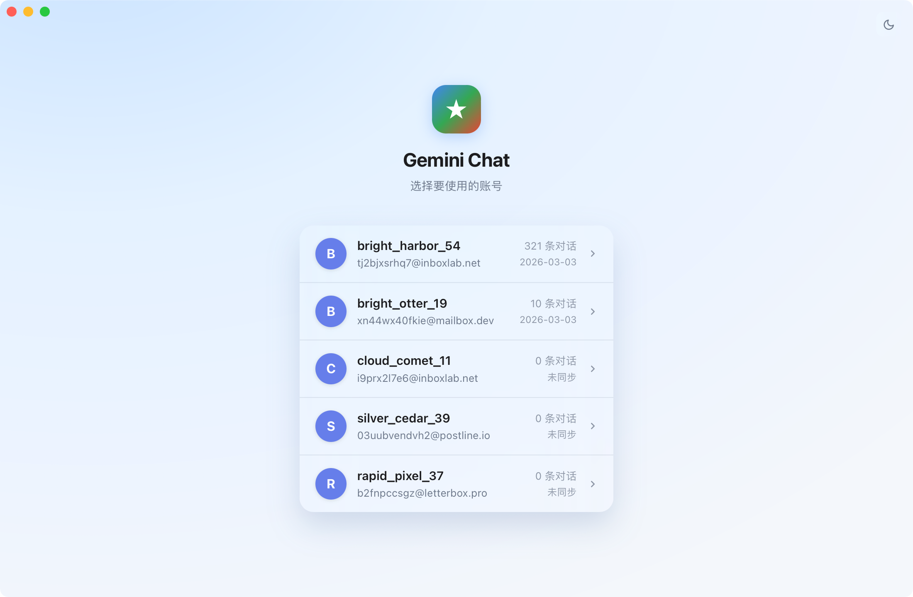
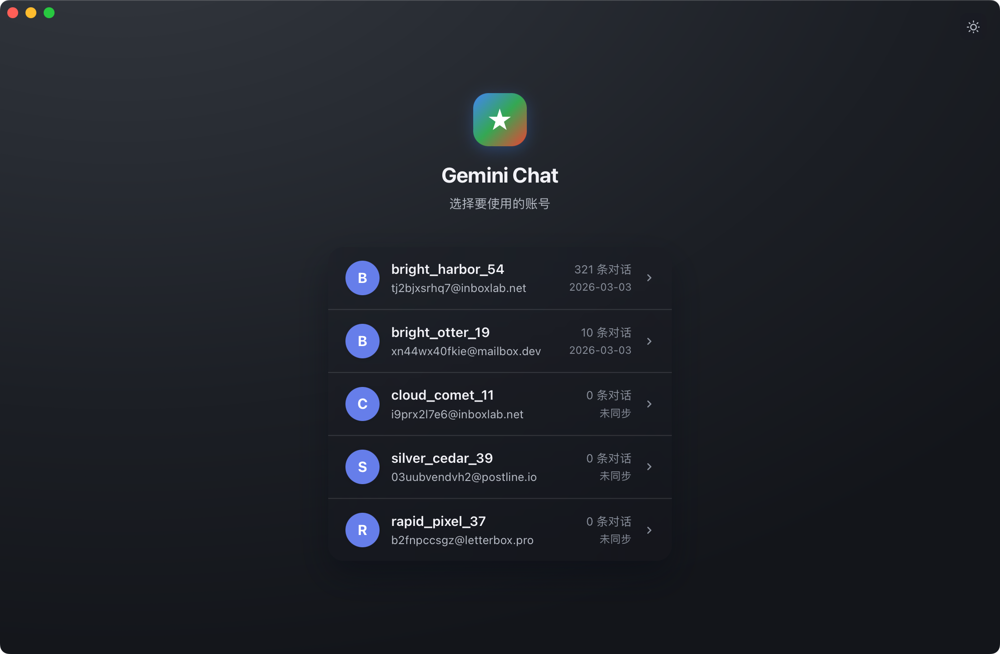
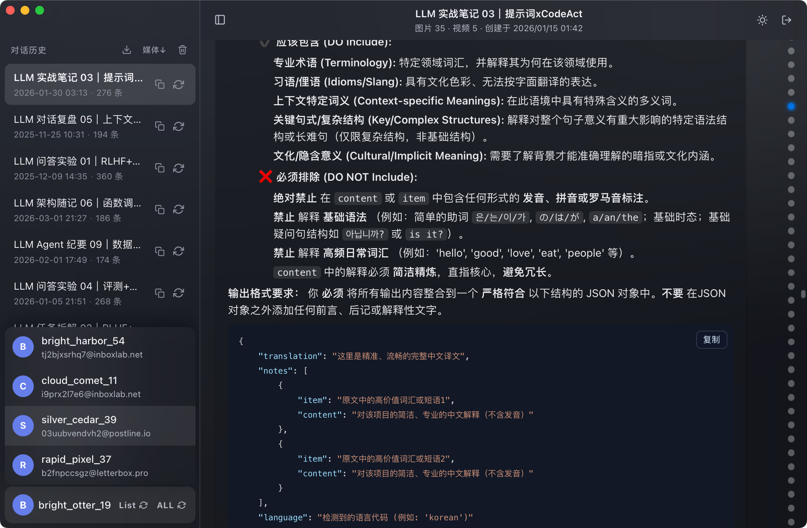
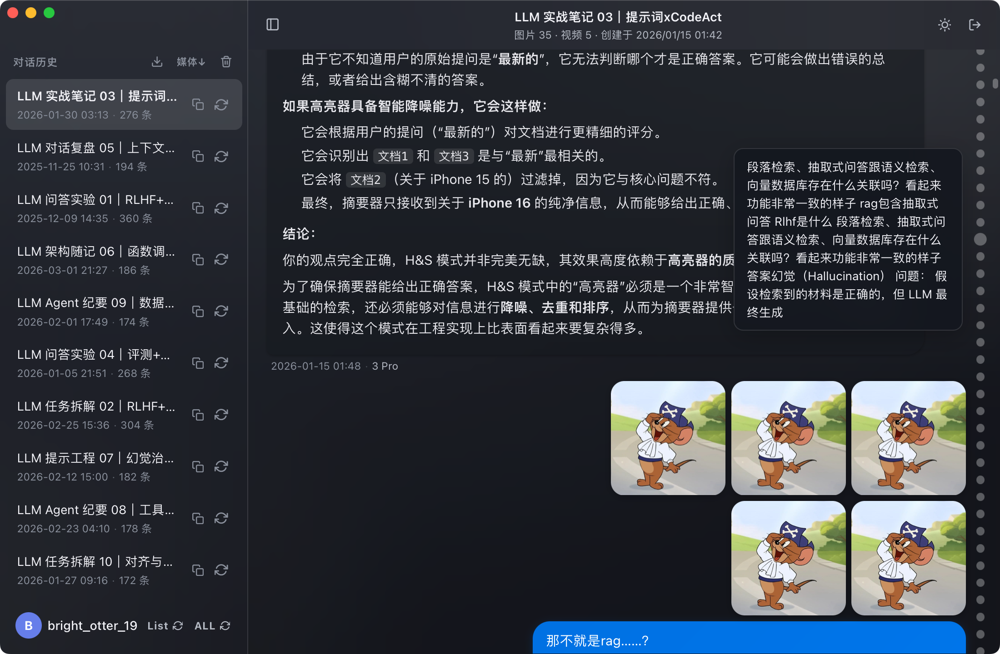
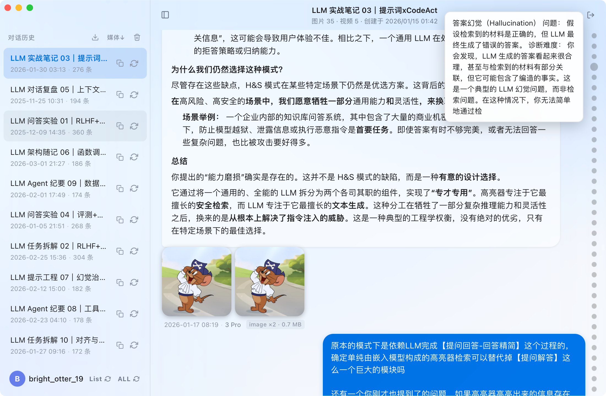
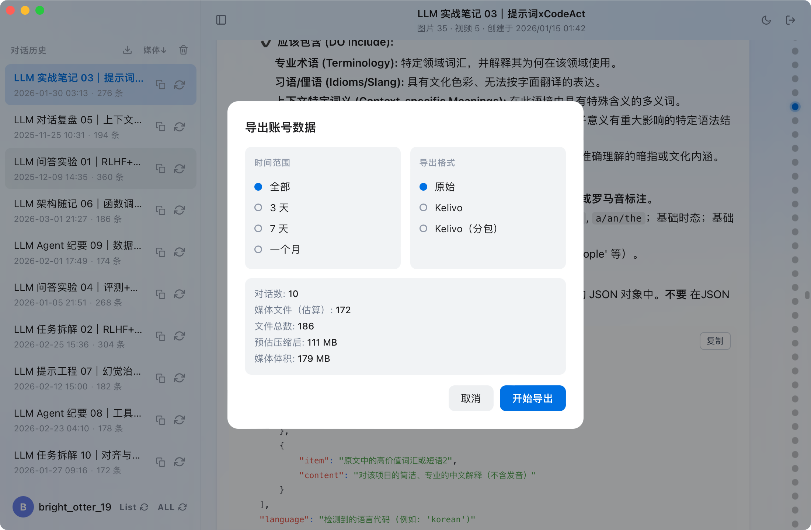

# Gemini Collector

**把你的 Gemini 对话与所有 AI 生成内容完整保存到本地**

macOS 原生应用 · 支持多账号 · 亮色 / 暗色主题

---

## 界面预览

| 默认主题 | 夜间主题 |
|:---:|:---:|
|  |  |

| 对话浏览 | 多媒体消息 |
|:---:|:---:|
|  |  |

| 对话导览 | 导出数据 |
|:---:|:---:|
|  |  |

---

## 功能特色

**零操作，立刻同步**
- 打开 App 即可看到本机 Chrome 已登录的所有 Gemini 账号，一键同步，无需任何配置
- 多账号同时在线，独立管理，增量更新，断点续传

**全量内容归档**
- 同步所有对话文本，完整保留上下文
- 用户上传的图片、视频一并同步到本地
- AI 生成的图片、音乐、视频等多媒体内容同步保存，不遗漏任何素材

**浏览体验**
- 原生 macOS 界面，支持亮色 / 暗色主题自动切换
- 对话内容完整渲染：Markdown、代码高亮、数学公式（LaTeX）
- 时间轴快速跳转，千条对话秒级定位
- 右键删除单条对话

**导出**
- 支持按时间范围筛选（全部 / 最近 3 天 / 7 天 / 一个月）
- 导出格式：
  - 原始数据
  - [Kelivo](https://github.com/Chevey339/kelivo)
  - [Kelivo](https://github.com/Chevey339/kelivo) 分包（将数据拆分为多个小包，解决 iOS 设备单次导入量有限的问题）
- 导出前预览文件数量与体积

---

## 安全

**所有操作均在本地完成，不上传任何数据。**

- 仅读取本机 Chrome 的 Cookie 完成 Gemini 授权
- 所有同步内容保存在本地，不经过任何第三方服务器
- 无需注册账号，无需额外授权

---

## 安装

| 平台 | 状态 | 说明 |
|:---|:---:|:---|
| macOS | ✅ 已支持 | 从 [Releases](https://github.com/FirenzeLor/gemini-collector/releases) 下载最新 `.dmg`，拖入 Applications 即可 |
| Windows | 🚧 待支持 | 计划中 |

> macOS 首次打开时若提示"无法验证开发者"，前往 **系统设置 → 隐私与安全性** 点击"仍要打开"即可。

---

## 使用前提

- macOS 12 及以上
- **已安装 Google Chrome**，并在 Chrome 中登录了 Gemini（[gemini.google.com](https://gemini.google.com)）
